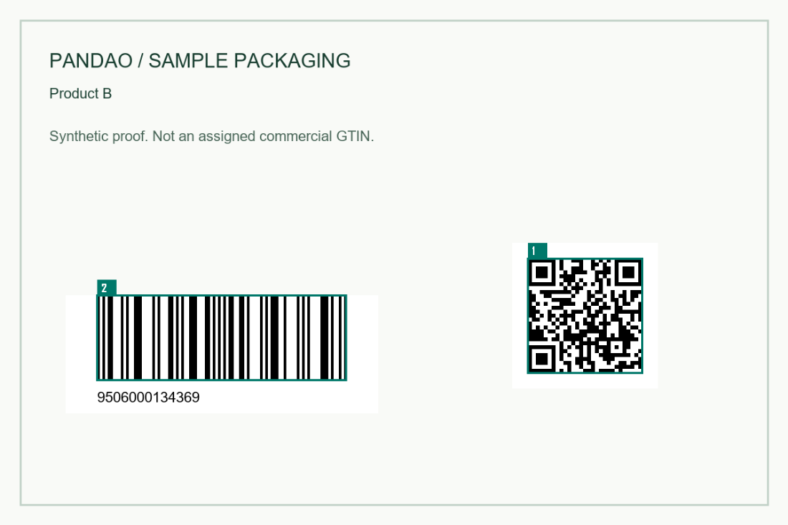

# Artwork Code Audit

Compare a batch of packaging proofs with an independently approved product list. Catch codes that agree with each other but identify the wrong SKU, conflicting linear and 2D codes, missing artwork pages, unlisted pages and exact repeated artwork. Download an annotated review packet without uploading artwork to a server.

[Working browser demo](https://tianchaodaxing-beep.github.io/pandao-artwork-code-audit/#demo) · [Version and downloads](https://github.com/tianchaodaxing-beep/pandao-artwork-code-audit/releases/tag/v0.1.1) · [Contact](mailto:tianchaodaxing@gmail.com)



## Start in the browser

Open the demo and choose **Try the 7-page sample**. The page actually renders and decodes a synthetic PDF with deliberate mistakes. Its expected result is **2 matched, 6 review items**: seven supplied pages plus a missing approved page.

For your own batch, select an approved CSV and one or more PDF, PNG or JPEG files. Select a page to see numbered codes and findings. Download the ZIP, extract it and open `review.html` beside its `previews` directory. Keep the product list independent of the proof; a list copied from incorrect artwork cannot reveal that error.

Modern desktop Chrome, Edge and Firefox are the intended browser targets. Use HTTPS or localhost. The browser downloads bundled reader resources from the same site; the chosen artwork stays in memory on your device. No analytics, server upload, account or code-URL lookup is included. The CLI runs locally after dependencies are installed.

## Local CLI

Use Node.js 24 or newer. Download and extract the source archive, then:

```sh
npm ci --ignore-scripts --no-audit --no-fund
node bin/audit.mjs --manifest docs/samples/approved.csv --artwork docs/samples/proofs.pdf --out first-review
```

Or install the release package:

```sh
npm install -g ./pandao-artwork-code-audit-0.1.1.tgz
artwork-code-audit --manifest approved.csv --artwork proof-a.pdf --artwork proof-b.png --out batch-review
```

Output directories must be new. Existing files are never overwritten. Add `--fail-on-review` for an approval pipeline: exit code `2` means the audit completed with review items, `1` means an input or runtime error, and `0` means completion without that gate failing. Read the report before approving artwork.

## Approved CSV

```csv
file,page,sku,gtin,linear_count,link_count,link_host
proof-a.pdf,1,SKU-A,09506000134352,1,1,id.example.com
proof-a.pdf,2,SKU-B,09506000134369,1,1,id.example.com
proof-b.png,1,SKU-C,00036000291452,1,0,
```

`file,page,sku,gtin` are required. Use a filename without directories, a page number starting at `1`, and one approved product per page. Images are page `1`. Filenames must be unique within a batch and are compared without case distinctions. Keep GTINs as text; leading zeros matter. An 8, 12, 13 or 14 digit GTIN must have a valid check digit. All comparisons use the zero-padded 14 digit value.

Optional `linear_count` and `link_count` default to `1`. Each accepts `0` to `16`; at least one expected count must be positive. Use `link_count=0` for linear-only artwork. Optional `link_host` checks the exact lowercase URL host, including a port if supplied. All readable supported codes on the page must belong to that row's GTIN.

Supported product codes:

- EAN-8, EAN-13 and UPC-A.
- QR Code or Data Matrix containing an uncompressed HTTP(S) GS1 Digital Link with `/01/` followed by a 14 digit GTIN.

Other readable formats, malformed links and decoder errors require manual review. Compressed Digital Links, GS1 element strings, UPC-E, Code 128 and multiple SKUs on one page are outside this version's comparison. Recognizing a format does not establish full GS1 conformance.

## Review packet

- `review.html`: offline page review with numbered previews.
- `report.json`: findings, decoded values, positions, expected counts and input SHA256 fingerprints.
- `issues.csv`: one row for every supplied or missing approved page; formula-like text is escaped for spreadsheet safety.
- `previews/page-NNNN.png`: reduced annotated page images.
- `READ-ME.txt`: practical review instructions.

The CLI also writes the packet as `artwork-review.zip`. Original artwork and the approved list are not modified or copied into that packet. Import GTIN columns as text if opening CSV in a spreadsheet. `report.json` retains the exact digit strings.

## Limits and interpretation

Up to 200 supplied pages, 100 MB per artwork file, 300 MB per batch, 24 million pixels per page, 2,000 approved rows and a CSV under 1 MB. PDFs render at 200 DPI. Exact duplicate detection compares rendered pixel content and dimensions; it does not detect near-identical artwork or decide whether an intentional repeat is valid. Different renderers can produce slightly different pixels and positions.

**Matched means supported decoded data agrees with the approved row and expected counts.** An unreadable, hidden, cropped or unsupported code needs manual review. A code that scans from a screen may still fail on press. This tool does not measure ISO barcode grades, quiet zones, physical code distance, color separation, company ownership or complete Digital Link syntax. Use a physical verifier and the relevant GS1 guidance before production approval.

The sample GTINs and artwork are synthetic demonstration material, not evidence of company allocation or customer work.

## Development

```sh
npm ci --ignore-scripts --no-audit --no-fund
npm test
python -m http.server 8080 --directory docs
```

Tests exercise actual decoding of the PDF and PNG/JPEG/Data Matrix fixtures, product mismatch decisions, counts, duplicates, missing pages, exports, input fingerprints and CLI output protection. Fixture symbols were generated independently from the application decoder. Automated Windows and Linux checks run on Node.js 24.

The audit rules and workflow are independently implemented. PDF.js, ZXing WASM and the Node canvas library provide document rendering and symbol decoding. Their versions and licenses are retained in [THIRD-PARTY-NOTICES.md](THIRD-PARTY-NOTICES.md). This project is MIT licensed; the bundled third-party assets retain their own licenses.

## Contact

For packaging batch workflows, print-preflight integration or a deployment request: [tianchaodaxing@gmail.com](mailto:tianchaodaxing@gmail.com).
